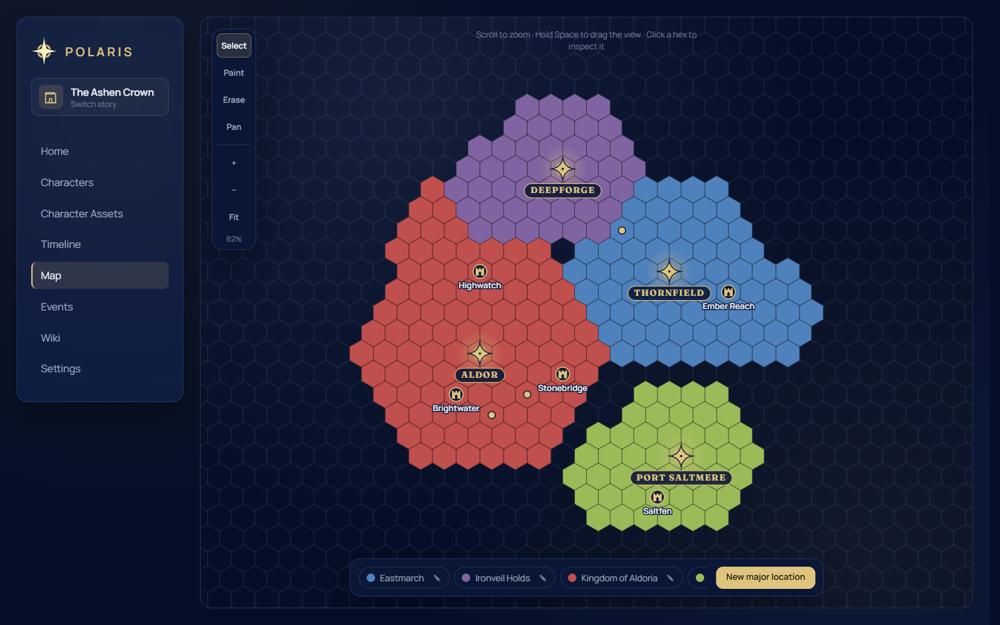
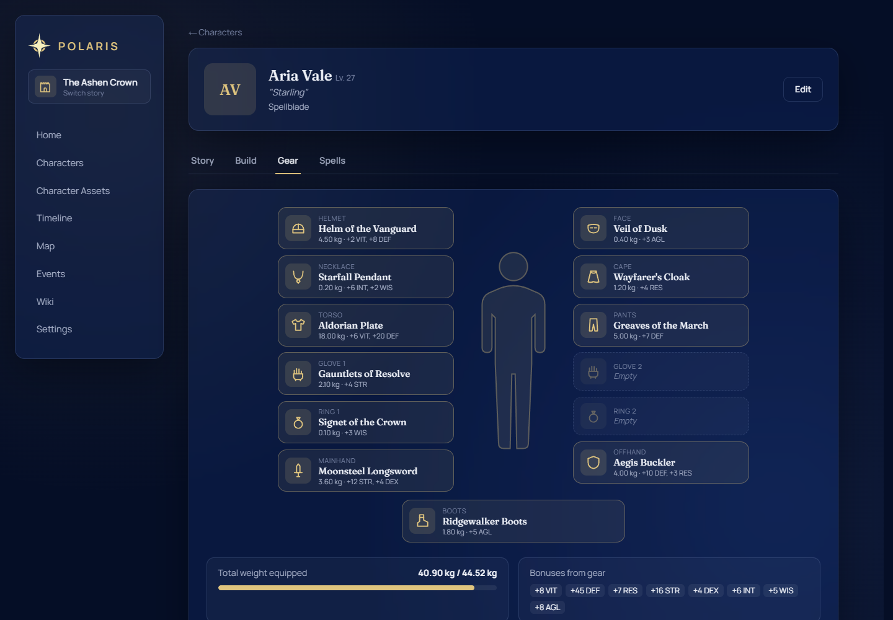
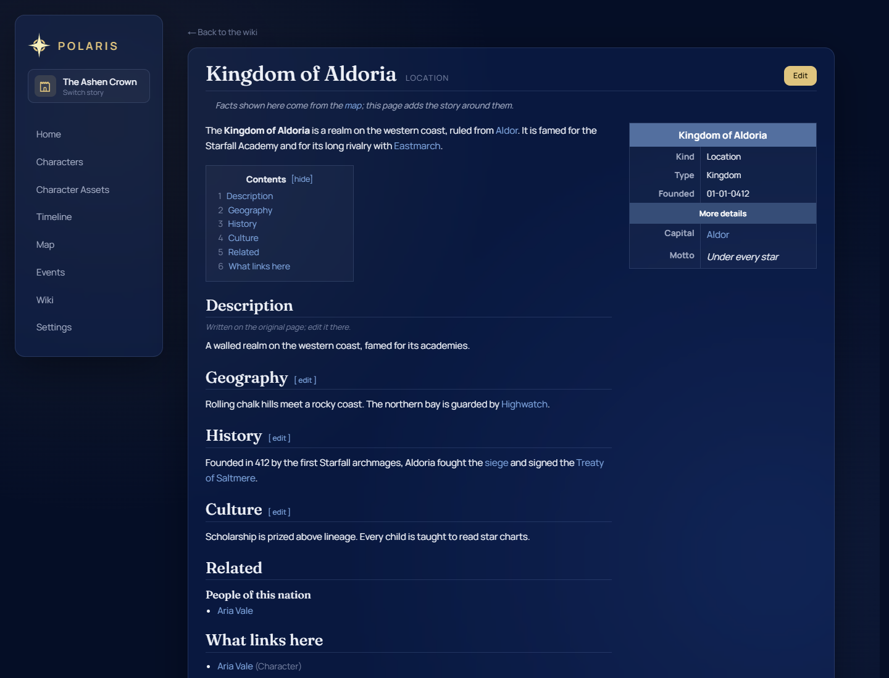
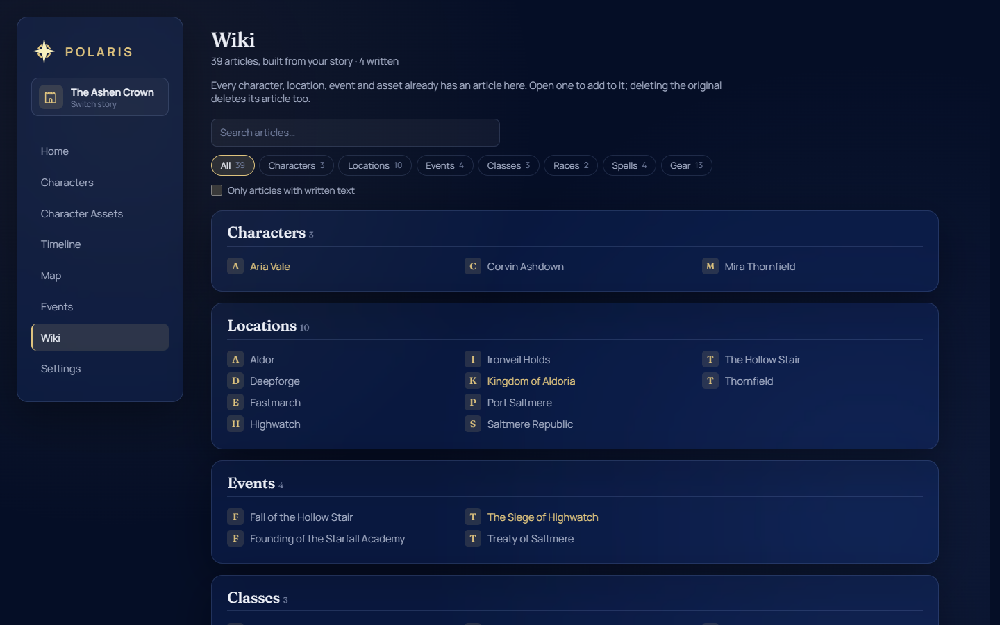

# Polaris

Polaris is a self-hosted campaign and character tracker for writers, game
masters and worldbuilders. It keeps everything about a story in one place
that you own: characters and how they change over time, their stats, gear and
spells, a hex map, a custom calendar, events, a timeline and a wiki that
writes itself from all of it.

Polaris is a single Go program with the web interface built in. Each story
has its own SQLite database, so it runs comfortably on a small home server.

> **Provided as is.** Polaris was built for personal use and is shared in case
> it is useful to others. There is no support and no commitment to future
> updates. See [LICENSE](LICENSE) (MIT).

## Features

- **Characters**: version history (compare any two versions side by side),
  alive / missing / dead status, automatically computed stats, a paper-doll
  gear tab, a spell list and a printable sheet.
- **Relations and factions**: who is whose parent, mentor, rival and so on,
  read correctly from both sides, with optional dates. Factions (guilds,
  orders, houses) can sit inside one another, have a headquarters on the map
  and members with ranks.
- **Character Assets**: classes, subclasses, specializations, races, body
  types, gear and spells, each of which can grant stat bonuses.
- **Map**: a paintable hex map with major locations you can inspect, brush
  sizes, and undo.
- **Wiki**: every character, location, faction, event, class, race, spell and
  piece of gear automatically gets an article, so there are no pages to create. Its
  infobox and related lists are read live from the rest of your story, and you
  add the lore on top: markdown boxes (history, personality, geography and so
  on), your own sections and infobox rows, `[[links]]` between articles and a
  "What links here" list. Delete something and its article goes with it.
- **Calendar, events and timeline**: define your own calendar (months per year,
  days per month), link events with tags, and view them on a timeline drawn to
  scale, filtered by person or place.
- **Chapters**: chapters grouped into volumes, each with your notes and the
  events and character changes that happen in it.
- **Search**: Ctrl+K finds any character, place, faction, event, asset or
  chapter.
- **Multiple stories**: each story is fully separate and can be exported to
  and imported from a `.zip` file. The story list shows when each was last
  exported.
- **Languages**: English, Português (Brasil), Español (España) and Español
  (Latinoamérica). Only the interface is translated, never your own content.
- **Themes**: five colour themes, chosen per device. Works on phones too.

## Screenshots

The screenshots use mock data.

**Map**: paint kingdoms on the hex map and place towns and landmarks.



**Character gear**: a paper-doll of equipped gear, with weight and the stat
bonuses it grants.



**Wiki**: an article built from the map and your own text, with an infobox,
contents and links to other articles.





## Security

> [!WARNING]
> **Polaris has no login.** Anyone who can reach it can read and change
> everything.

For this reason the default setup listens only on `127.0.0.1`, so only the
machine running it can open it.

To use Polaris from other devices, put your own access control in front of
it, for example:

- a reverse proxy that requires authentication,
- a VPN such as Tailscale or WireGuard, or
- a tunnel with access control, such as Cloudflare Tunnel with Cloudflare
  Access.

Then set `BIND_ADDR` (see [Configuration](#configuration)) so it listens on
your network. **Do not forward its port directly to the internet.**

## Quick start (Docker)

Requirements: Docker with the Compose plugin.

```bash
git clone https://github.com/AstraLumi/polaris.git
cd polaris
docker compose up -d --build
```

Open <http://localhost:8091> and create your first story.

## Configuration

Copy `.env.example` to `.env` and edit it. Docker Compose reads it
automatically, and git ignores it, so your settings are kept across updates.

| Variable    | Default     | Description                                                       |
|-------------|-------------|-------------------------------------------------------------------|
| `BIND_ADDR` | `127.0.0.1` | Host address to listen on. `0.0.0.0` exposes it to your network.  |
| `HOST_PORT` | `8091`      | Port on the host.                                                 |

The application itself reads the following variables. `docker-compose.yml`
already sets them, so you only need them when
[running without Docker](#running-without-docker).

| Variable      | Default        | Description                                |
|---------------|----------------|--------------------------------------------|
| `PORT`        | `8091`         | Port the server listens on.                |
| `DATA_DIR`    | `/data`        | Folder for the story databases.            |
| `UPLOADS_DIR` | `/app/uploads` | Folder for uploaded pictures and icons.    |

## Data and backups

All data is stored in two Docker named volumes, which rebuilding or updating
the container never touches:

- `polaris_data`: the story databases
- `polaris_uploads`: uploaded pictures and icons

**Export (recommended).** On the story picker, **Export** saves a story,
including its database and pictures, as a `.zip`. **Import** restores a zip as
a new story, which also lets you move stories to another machine. Export
regularly, and always before updating.

**Raw volume backup.** To archive the volumes directly:

```bash
docker run --rm -v polaris_data:/d -v "$PWD":/b alpine tar czf /b/polaris_data.tgz -C /d .
docker run --rm -v polaris_uploads:/d -v "$PWD":/b alpine tar czf /b/polaris_uploads.tgz -C /d .
```

## Updating

Back up first (see above), then run:

```bash
./scripts/update.sh
```

The script pulls the latest code (fast-forward only), rebuilds and restarts
the container, and removes old images. Doing it by hand is equivalent to:

```bash
git pull
docker compose up -d --build
```

Databases are upgraded automatically on start-up and keep all their data.
Upgrades are one-way: once upgraded, a database cannot be opened by an older
version of Polaris.

## Running without Docker

Requirements: Go 1.26+ and Node.js 24+.

```bash
cd frontend && npm ci && npm run build
cp -r dist/. ../backend/static/
cd ../backend
go build -o polaris .
DATA_DIR=./data UPLOADS_DIR=./data/uploads ./polaris
```

The server listens on port 8091 on **all interfaces**. If the machine is on a
shared network, restrict access as described under [Security](#security).

## Stat formulas

> [!NOTE]
> Polaris calculates stats (HP, Attack, Carry Limit, Luck, and the rest) with
> formulas tuned for the author's own setting and rules. They are not meant
> to be a general system, and there is no screen for changing them. If you
> use Polaris for your own world, you will probably want different numbers.

Stats are calculated every time a character is shown and are never stored,
so changing a formula updates every character at once. It needs no database
change and puts no data at risk.

The calculation runs in two steps:

1. **Primary stats.** The 8 points spent on a character (VIT, DEF, RES, STR,
   DEX, INT, WIS, AGL) plus any bonuses from class, race, gear and so on.
2. **Everything else** (Base Stats, Special Stats, Special Defenses and
   Lifeskills) is calculated from those by the formulas in
   [`backend/stats_formulas.go`](backend/stats_formulas.go). Class, race and
   gear bonuses are added on top afterwards.

### Using your own formulas

Don't edit `stats_formulas.go`: updates change it. Put your formulas in a
file of your own instead, which updates never touch:

1. Copy `backend/stats_custom.go.example` to `backend/stats_custom.go`. Git
   ignores that file, so `git pull` and `scripts/update.sh` leave it alone.
2. In it, list only the stats you want to change. Every stat you leave out
   keeps its default. For example, 15 HP per point of VIT instead of 10:

   ```go
   "hp": 10 + in.VIT*15 + in.Level*2,
   ```

   The example file lists everything a formula can read (`in.STR`,
   `in.Level`, `in.WeightKG`, numbers typed on the sheet with
   `in.Base("sanity")`, …) and the name of every stat you can set.
3. Rebuild: `docker compose up -d --build`. If you have Go installed, run
   `cd backend && go test ./...` first; it catches typos before they reach
   the server.

To go back to the defaults, delete `stats_custom.go` and rebuild.

If an update ever changes what formulas can read, your file stops compiling
and the build error names it. Compare it with `stats_formulas.go`, adjust,
and rebuild. Your numbers never change silently.

## Privacy

The interface loads its fonts from Google Fonts, so your browser contacts
Google to fetch them. Polaris makes no other external requests.

## Development

Architecture notes and contribution guidelines are in
[docs/DEVELOPMENT.md](docs/DEVELOPMENT.md).
